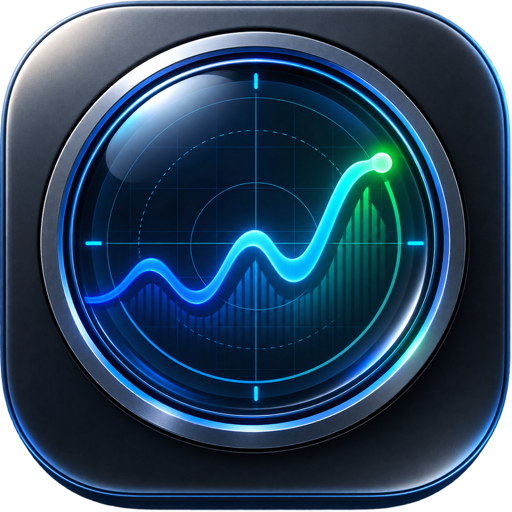

<p align="center">
  
</p>

<h1 align="center">MacScope</h1>

<p align="center">
  Native system intelligence and a focused power-user toolkit for Apple-silicon Macs.
</p>

<p align="center">
  <a href="https://rsm23.github.io/macscope/">Website</a> ·
  <a href="#build-and-test">Build guide</a> ·
  <a href="docs/MCP_SERVER.md">MCP server</a> ·
  <a href="#security-and-privacy">Security</a>
</p>

MacScope combines live system telemetry, safe process management, reversible macOS controls, and the utilities that usually require a collection of separate apps. It is written in Swift and SwiftUI for macOS 14 or newer and currently targets Apple silicon.

> MacScope is under active development. Download the signed release or build it from source. Deep telemetry and protected actions remain permission-gated by macOS.

## Download

Download MacScope 0.1.0 for Apple-silicon Macs running macOS 14 or newer:

- [Download the drag-to-Applications DMG](https://github.com/rsm23/macscope/releases/download/v0.1.0/MacScope-0.1.0-arm64.dmg)
- [Verify its SHA-256 checksum](https://github.com/rsm23/macscope/releases/download/v0.1.0/MacScope-0.1.0-arm64.dmg.sha256)
- [Download the ZIP archive](https://github.com/rsm23/macscope/releases/download/v0.1.0/MacScope-0.1.0-arm64.zip)

The release is signed with an Apple Developer ID, notarized by Apple, and stapled for offline Gatekeeper verification. Open the DMG and drag MacScope to Applications; no security bypass is required.

## At a glance

| Area | What MacScope includes |
| --- | --- |
| System monitor | CPU, GPU/ANE availability, memory, network, storage, SMART, thermals, fans, battery, power, hardware, history, and raw data |
| Process manager | Sortable process data, hierarchy/grouping, executable paths, disk I/O, safe signals, and privileged actions with PID-reuse protection |
| Utility suite | Sound, Capture, Windows, Clipboard, Notes, Maintain, and Power workspaces |
| macOS controls | 226 catalog entries: 106 direct controls, 114 System Settings guides, and 6 intentionally restricted actions |
| Fast access | Menu-bar monitor, Quick Panel, Command Bar, radial launcher, app/window switcher, file shelf, and global shortcuts |
| Agent access | Local stdio MCP server with redacted reads, 89 typed utility actions, explicit write modes, and no arbitrary shell execution |

## System monitoring

### Overview and history

- Live overview for CPU, memory, GPU/ANE availability, network traffic, process count, thermal state, and power
- Aggregate and per-logical-core CPU usage with user/system breakdown and load averages
- SQLite-backed 10-second samples and one-minute rollups
- Optional Keychain-backed AES-GCM process history
- Redacted inventory JSON and locale-independent metrics CSV export
- Raw JSON inspector and structured, searchable system snapshots

### Memory, accelerators, thermals, and power

- VM memory totals for active use, wired memory, compression, cache, free memory, and swap
- GPU and Apple Neural Engine activity, frequency, and power when supported by the approved telemetry path
- Thermal-pressure state, SMC sensor groups, sensor placement, hottest-sensor history, and fan RPMs
- Battery charge, health, cycle count, temperature, adapter state, system/battery/CPU/GPU/ANE power, and history charts
- Honest availability states: unsupported or model-specific values appear as unavailable, restricted, degraded, or unmapped—never invented zeroes

### Network, storage, and SMART

- Per-interface upload/download rates, addresses, packet counts, and errors
- Mounted-volume capacity plus APFS physical-device deduplication
- Live physical-disk read/write throughput, IOPS, interval bytes and operations, average request size, latency, service time, errors, retries, and cumulative driver counters
- System-reported SMART health and all fields returned by `diskutil`

### Processes, startup, and hardware

- Process CPU, memory, thread count, state, executable path, and cumulative disk I/O
- Search, sort, selection locking, hierarchical grouping, combined descendant values, and safe process signals
- PID-safe privileged actions that re-read process start time before execution
- LaunchAgent and LaunchDaemon discovery across user, local, and system domains
- Typed `launchctl` actions through the optional helper; no arbitrary command strings
- Hardware and operating-system inventory with privacy-aware export

## Utilities

Every optional module can be installed or removed from the Features hub. The system monitor, audio mixer, and live disk preview remain available because the Quick Panel depends on them.

### Sound

- Switch the default output and input; cycle outputs from a shortcut or Quick Panel
- Pin a preferred microphone input and restore it when macOS changes devices
- Mute or restore all input, system output, or individual applications
- Set independent per-app volume from 0–200%
- Route supported running apps to a specific output device
- Lower output volume automatically after headphones disconnect
- Optional Apple Music auto-launch blocker
- The same practical mixer is available in the compact Quick Panel

### Capture and media

- Full-display, exact-window, and selection screenshots with timers, naming, date folders, clipboard copy, and optional 1× downsampling
- Post-capture Preview, reveal, pin, share, and local-network link actions with token expiry and early revocation
- Guided automatic window scrolling capture plus manual top-to-bottom stitching
- Dual pixel and PNG-file clipboard representations
- Non-destructive screenshot editor with crop, rectangle, arrow, pen, text, stickers, redaction, export backgrounds, and undo
- Local Vision OCR and QR detection with direct QR actions
- HEX, RGB, HSL, and SwiftUI color sampling
- Floating capture pins and a camera mirror that dismisses when it loses focus
- Exact-window or display recording with pause/resume and optional system-audio and microphone tracks
- Click metadata for adjustable focus-following zooms
- Local recording editor for trim, cut, crop, compression, 0–200% audio mixing/removal, text, padded backgrounds, presets, and bounded animated-GIF export
- Reviewed copy, reveal, and copy-and-Trash actions for the latest recording

### Windows and input

- Half, third, corner, center, maximize, restore, and cross-display window layouts
- Opt-in edge snapping with a live per-display preview
- Control-Option drag-anywhere movement and resizing
- Optional green-button maximize/restore without creating a Space
- Per-app quit-on-last-window-close rules
- Searchable app and exact-window switcher with minimized windows, grouped app mode, adjustable live thumbnails, and thumbnail privacy exclusions
- Window-only and hide rules plus a direct front-app window-cycle shortcut
- Keyboard debounce, independent mouse-wheel direction, smooth scrolling, and focus-follows-mouse
- Recorded extra-mouse-button shortcuts with Back/Forward defaults and per-app exclusions

### Clipboard and files

- Opt-in text, image, and file clipboard history with search, favorites, and sleep/display-lock clearing rules
- Persistent text snippets with folders, global triggers, clipboard variables, and custom date/time formats
- Tracking-URL cleanup and optional automatic cleanup on copy
- Global plain-text paste
- Finder cut, rename, and copied-image-to-PNG shortcuts
- Session shelf for text, URLs, files, and folders
- Top-edge workflow: drag items to park them, navigate to a Finder destination, then click the shelf to move them without overwriting conflicts
- Full drag-in/drag-out shelf available by shortcut, radial action, or configurable screen-edge dwell

### Notes

- Named Markdown scratchpads in a focused tabbed workspace
- Optional quiet-period clearing for transient or sensitive working notes
- Scratchpad creation, update, rename, clear, and delete through the local MCP utility catalog when explicitly enabled

### Maintain

- Reviewed application uninstall-to-Trash with related-file discovery
- Optional deeper user/system Library discovery with a Full Disk Access guide
- Cache, log, and large-download discovery
- Metadata-confirmed messaging-download retention and organization
- Optional daily, recoverable Trash cleanup or collision-safe organization
- App Store catalog and Homebrew update sources that can be enabled independently
- Searchable Homebrew install, remove, update, and reviewed sequential Update All
- Profiled batch image conversion, OCR, and animated-GIF creation
- Local video compression plus duration-aware trim, cut, crop, and GIF export

### Power and displays

- Native keep-awake assertions for a duration or indefinitely, with optional display-awake behavior
- Automatic keep-awake rules for AC power or an external display
- Bounded cleaning mode that temporarily blocks local keyboard and mouse input
- Public IOKit brightness controls for displays with a writable hardware channel
- Per-display CoreGraphics software dimming with one-click and automatic ColorSync restoration

## Fast-access surfaces

### Command Bar

The searchable Command Bar can open MacScope sections, applications, and exact windows; run the previously active app's Accessibility-exposed menu commands; calculate arithmetic, units, and natural dates; answer live questions about this Mac; find captures; run audio and power actions; open System Settings panes and URLs; search emoji; act on selected text; insert snippets or clipboard text; search user-chosen folders through Spotlight; and run explicitly added local scripts with visible, copyable output.

App results support aliases, pinning, reveal, quit, confirmed force-quit, and restart. Bug or feature mail is prepared as a draft only after optional technical details are shown.

### Quick Panel, menu bar, and Dock

- Configurable value or usage-bar menu-bar monitor for CPU, memory, network, battery/time, and fan speed
- Reorderable Quick Panel tabs from the menu bar, `⌃⌘V`, or reopening from the Dock
- Optional exact-window thumbnails plus Overview and Quick controls
- Always-available audio mixer and live physical-disk read/write throughput
- Screenshot, keep-awake, lock-screen, Finder visibility, appearance, keyboard-light, eject-volume, and confirmed empty-Trash actions

### Radial launcher and shortcuts

- Hold, point, and release radial launcher on `⌃⌥Space`
- Editable eight-slot Work, Media, and System profiles with independent themes
- Targets for apps, files, folders, websites, emitted key combinations, and MacScope actions
- Nested media wheel for playback, tracks, and volume
- Categorized global-shortcut editor with enable switches, key/modifier pickers, immediate registration, and duplicate detection
- Shortcuts for Command Bar, switcher, Quick Panel, radial launcher, shelf, and three screenshot actions

## macOS Features catalog

MacScope currently ships 226 categorized entries across appearance, Finder, Dock, Mission Control, windows, keyboard/text, applications, security, privacy, power, sharing, and related system areas.

- 106 direct reversible controls with live values, clear support states, confirmation where needed, and exact-value undo
- 114 guided routes into the appropriate System Settings pane
- 6 deliberately restricted actions where bypassing macOS or organizational policy would be unsafe
- Collapsible categories, search, filtering, tiers, restart requirements, and runtime compatibility states
- Reviewable settings export/import that excludes scratchpads, snippets, clipboard data, and retained history

## Local MCP server

MacScope bundles a local stdio Model Context Protocol server for AI agents. It exposes redacted telemetry, the macOS feature catalog, live utility state, 89 allowlisted utility actions, and bounded screenshot/recording artifact access.

The server starts read-only. Sensitive reads, feature writes, utility writes, and artifact bytes each require explicit launch flags. Feature changes use expiring preflight tokens, exact confirmation, and stale-state-safe undo. Utility calls accept only compiled action IDs and typed arguments; the server does not accept arbitrary shell commands, executable paths, preference domains, or keys.

Setup, client examples, permission modes, resources, tools, and the complete action catalog are documented in [docs/MCP_SERVER.md](docs/MCP_SERVER.md).

## Remote mobile apps

The native Expo app provides paired iPhone and Android access through the outbound-only Cloudflare relay. The checked-in production configuration uses `https://macscope-remote.macscope-relay.workers.dev`, and the mobile project is linked to `@rsm23/macscope-remote` on EAS. Pairing is single-use and expires after ten minutes; live telemetry and command arguments are not stored by the relay.

The mobile app includes detailed live metrics, searchable running processes with PID-safe termination, question-driven settings for every remote utility, inline command results, and a Library for screenshots, recordings, and clipboard content. Screenshot and recording files are streamed directly from the Mac in bounded chunks and are never persisted by the relay.

Run `pnpm test`, `pnpm check`, and `pnpm lint` from `mobile/`, or manually dispatch **Mobile CI and EAS Builds** in GitHub Actions after adding the `EXPO_TOKEN` repository secret. The complete deployment, pairing, security, and build instructions are in [docs/REMOTE_CONTROL.md](docs/REMOTE_CONTROL.md).

## Security and privacy

- Telemetry and history stay local
- Protected functionality is requested only when its control is used
- Screen capture/recording, camera, Accessibility, Input Monitoring, Automation, notifications, and Full Disk Access remain visibly controlled by macOS
- The optional helper exports structured telemetry and typed requests only
- Helper clients are code-identity checked and restricted to signed MacScope executables at exact bundle locations
- Developer ID builds require a matching Team ID
- Process actions protect against PID reuse
- `launchctl` calls use fixed argument arrays and never delete or rewrite third-party property lists
- MCP is stdio-only, opens no network port, and redacts sensitive data by default
- SIP and TCC failures are reported; MacScope does not attempt to bypass them

## Build and test

Requirements: macOS 14 or newer, Apple silicon, Swift 6.1+, and Xcode 26 for workspace development.

```bash
swift build
swift test
./Scripts/build-app.sh
open dist/MacScope.app
```

The packaging script builds `MacScope`, `MacScopeHelper`, and `MacScopeMCPServer`, assembles the app bundle, installs the MacScope icon, ad-hoc signs development builds, and verifies the final signature.

Open `Package.swift` or `MacScope.xcworkspace` in Xcode. The package contains these primary targets:

- `MacScope`: SwiftUI application and native utility services
- `MacScopeCore`: telemetry, models, persistence, feature catalog, and privileged protocols
- `MacScopeHelper`: optional privileged telemetry and typed action helper
- `MacScopeMCPBridge`: shared typed MCP gateway and utility contracts
- `MacScopeMCPServer`: packaged local stdio server

## Release signing and notarization

Development builds are ad-hoc signed. Set `DEVELOPER_ID_APPLICATION` to a Developer ID Application identity for release signing. Notarization credentials are intentionally excluded from the repository.

For a local Developer ID release, install the certificate and its private key in Keychain. Store notarization credentials once in the login Keychain; `notarytool` prompts securely for the app-specific password:

```bash
xcrun notarytool store-credentials MacScopeNotary \
  --apple-id YOUR_APPLE_ID \
  --team-id YOUR_TEAM_ID
```

Then run the Keychain-backed release without putting credentials in a file:

```bash
NOTARY_KEYCHAIN_PROFILE=MacScopeNotary NOTARY_TEAM_ID=YOUR_TEAM_ID \
  ./Scripts/release-local.sh --preflight
NOTARY_KEYCHAIN_PROFILE=MacScopeNotary NOTARY_TEAM_ID=YOUR_TEAM_ID \
  ./Scripts/release-local.sh
```

The release script validates the Keychain profile with Apple and selects the matching Team ID identity. It signs, notarizes, staples, and Gatekeeper-checks the app; then it signs, notarizes, staples, and Gatekeeper-checks the DMG before producing final SHA-256 checksums. An environment file is read only when `MACSCOPE_ENV_FILE` is explicitly set.

GitHub Actions test every push, validate mobile changes, and deploy the static landing page. The manually dispatched mobile workflow starts the Android APK and iOS Simulator EAS builds when `EXPO_TOKEN` is configured. The `Release MacScope` workflow can also be run manually and runs automatically for `v*` tags. It imports the Developer ID identity into an ephemeral keychain, signs and notarizes the app and DMG, verifies Gatekeeper, uploads the build artifacts, and publishes tag releases. The workflow fails closed if any signing or notarization secret is missing, so only verified Developer ID releases are published.

## Known boundaries

- Deep GPU, ANE, frequency, power, fan, and SMC readings depend on model support and the approved helper
- Some Apple-silicon/macOS combinations expose new `powermetrics` counter names; MacScope preserves raw provenance and reports degraded mapping honestly
- Screen capture, recording, camera, window management, input tools, and deeper file discovery require their matching macOS permissions
- Hardware brightness is available only when a display exposes a writable IOKit channel; software dimming is the reversible fallback
- This repository currently builds an arm64 app for macOS 14+
